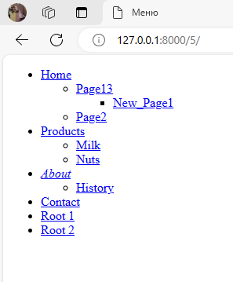

# Меню для веб-приложения на Django

Проект представляет собой веб-приложение на Django для отображения динамического меню. Все, что над выделенным пунктом - развернуто. Первый уровень вложенности под выделенным пунктом тоже развернут. Активный пункт меню выделяется курсивом и определяется исходя из URL текущей страницы. Адрес страницы содержит id пункта меню, по которому определяется активный пункт меню.
Пример:

При клике на меню происходит переход по заданному в нем URL. URL для пункта меню задается в поле `url` при создании объекта модели. При создании пункта меню вы можете указать адрес, который будет использоваться для перехода по данному пункту меню. 
## Установка

1. Клонируйте репозиторий и перейдите в него в командной строке:

git clone https://github.com/HelenVlad/TreeMenu.git

2. Установите и активируйте виртуальное окружение

python -m venv venv

  Для Unix-подобных систем:
  
source venv/Scripts/activate

  Для Windows:
  
venv\Scripts\activate

3. Установите необходимые зависимости с помощью команды:

pip install -r requirements.txt

4. Примените миграции для создания базы данных:

python manage.py migrate

5. Запустите локальный сервер разработки:

python manage.py runserver

6. Добавьте меню через admin страницу. Для доступа к админ-панели перейдите по адресу `http://127.0.0.1:8000/admin/`. Войдите с использованием учетных данных администратора проекта.

Регистрация администратора: 

python manage.py createsuperuser

6. Откройте веб-браузер и перейдите по адресу [http://127.0.0.1:8000/](http://127.0.0.1:8000/) для просмотра приложения.

## API

- `draw_menu(id_item)`: Функция для отображения меню с заданным идентификатором. Находится по пути "TreeMenu/menu/templatetags/menu/menu_tags.py". 
Для отображения меню на странице используется тег `` с передачей id текущего меню.

## Админ-панель

Админ-панель Django предоставляет удобный интерфейс для управления данными проекта. В данном проекте админ-панель настроена для управления пунктами меню.

### Пункты меню

- **Список пунктов меню:** Показывает список всех пунктов меню, включая их идентификатор, название, связанный родительский пункт, и URL.
- **Фильтрация по идентификатору и названию:** Позволяет фильтровать пункты меню по их идентификатору и названию.
- **Встраиваемая форма для дочерних пунктов меню:** При редактировании родительского пункта меню вы можете управлять его дочерними пунктами с помощью встраиваемой формы, где вы можете изменять их название, идентификатор, URL и другие параметры.

## Зависимости

- Django 5.0.4
- Python 3.11.4
